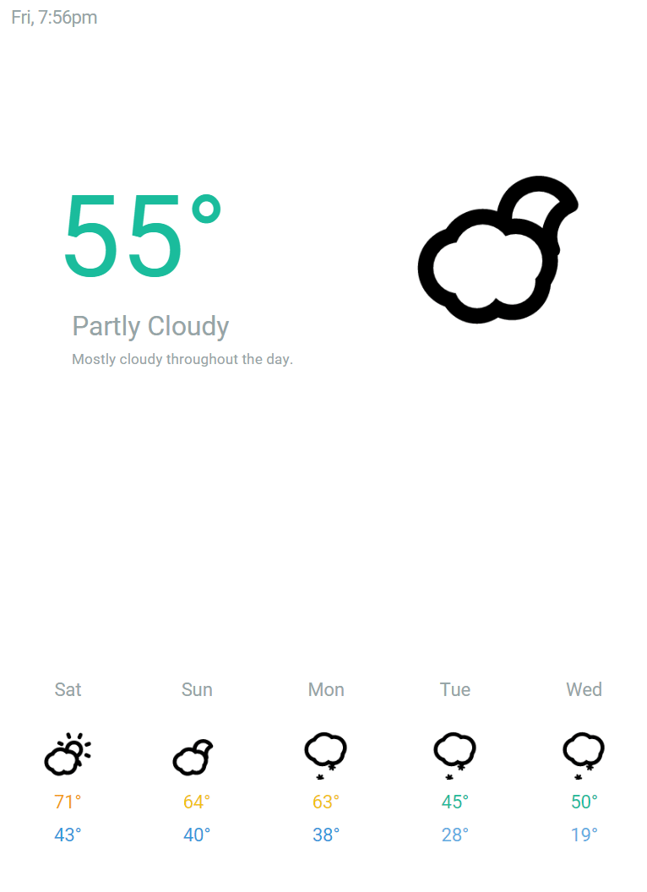

# Front Door Dashboard

> Simple web app for the purpose of mounting by the front door

## Installation

1. `git clone` and `npm install`
2. Fill in API key, latitude, and longitude in app.js
3. `gulp` for dev or serve the `/app` directory for prod

## Tech

* Angular
* [Forecast.io API](https://developer.forecast.io/)
* [Skycons](https://darkskyapp.github.io/skycons/)

### Features

* Current forecast and condition
  * Conditionally shows 'feels like' temp if > 5 degrees than real
  * Conditionally shows precipitation probability if over 20%
* 5-day forecast
* Future forecast by clicking on 5-day

### To Do / Enhancements

- Google Calendar integration for upcoming events
- News feeds for top news
